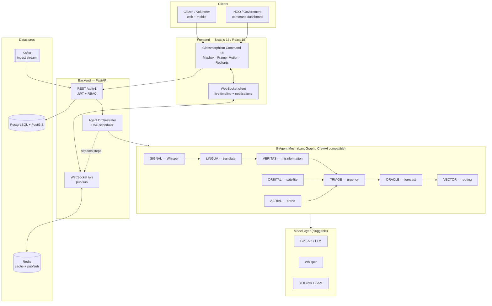
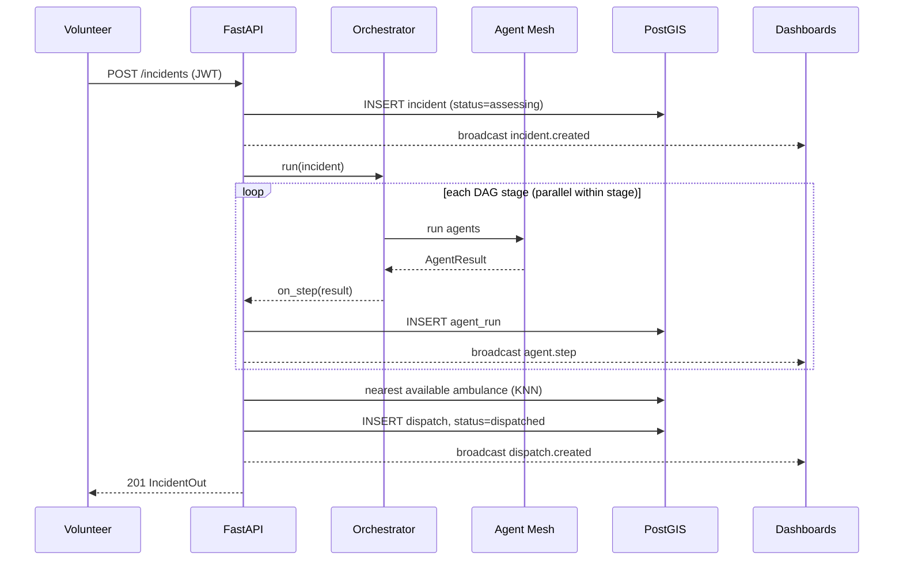
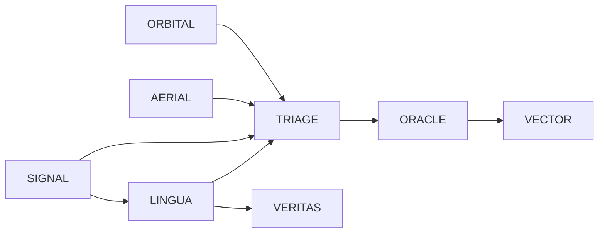

# NEXUS AI — Architecture

## System overview

## Request lifecycle — creating an incident

## Agent dependency DAG

Perception (ORBITAL, AERIAL) and intake (SIGNAL→LINGUA→VERITAS) run
concurrently; TRIAGE fuses them; ORACLE forecasts demand; VECTOR routes.
The scheduler groups agents into stages so each stage runs in parallel.

## Scaling notes
- **Stateless API** replicas behind a load balancer; sticky sessions not
  required (JWT). WebSocket fan-out moves to Redis pub/sub for >1 replica.
- **Kafka** decouples high-volume ingest (calls, sensors, social) from the
  synchronous request path; a consumer feeds the orchestrator.
- **PostGIS** GiST indexes serve radius and KNN (`<->`) queries for nearest
  resource selection.
- **Models** scale independently — GPU pods for YOLO/SAM, hosted API for LLM.
