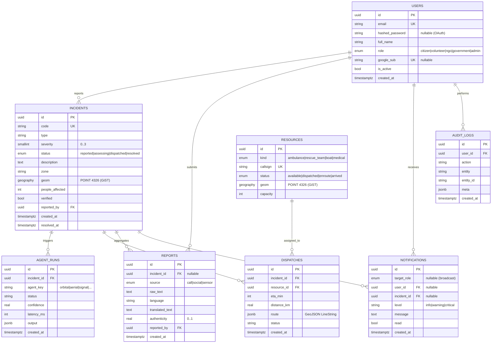

# NEXUS AI — Entity-Relationship Diagram

Normalized to 3NF. See `backend/app/db/schema.sql` for the physical PostGIS DDL.

```mermaid
erDiagram
    USERS ||--o{ INCIDENTS : reports
    USERS ||--o{ REPORTS : submits
    USERS ||--o{ NOTIFICATIONS : receives
    USERS ||--o{ AUDIT_LOGS : performs

    INCIDENTS ||--o{ AGENT_RUNS : triggers
    INCIDENTS ||--o{ DISPATCHES : has
    INCIDENTS ||--o{ REPORTS : aggregates
    INCIDENTS ||--o{ NOTIFICATIONS : raises

    RESOURCES ||--o{ DISPATCHES : assigned_to

    USERS {
        uuid id PK
        string email UK
        string hashed_password "nullable (OAuth)"
        string full_name
        enum role "citizen|volunteer|ngo|government|admin"
        string google_sub UK "nullable"
        bool is_active
        timestamptz created_at
    }

    INCIDENTS {
        uuid id PK
        string code UK
        string type
        smallint severity "0..3"
        enum status "reported|assessing|dispatched|resolved"
        text description
        string zone
        geography geom "POINT 4326 (GiST)"
        int people_affected
        bool verified
        uuid reported_by FK
        timestamptz created_at
        timestamptz resolved_at
    }

    AGENT_RUNS {
        uuid id PK
        uuid incident_id FK
        string agent_key "orbital|aerial|signal|..."
        string status
        real confidence
        int latency_ms
        jsonb output
        timestamptz created_at
    }

    RESOURCES {
        uuid id PK
        enum kind "ambulance|rescue_team|boat|medical"
        string callsign UK
        enum status "available|dispatched|enroute|arrived"
        geography geom "POINT 4326 (GiST)"
        int capacity
    }

    DISPATCHES {
        uuid id PK
        uuid incident_id FK
        uuid resource_id FK
        int eta_min
        real distance_km
        jsonb route "GeoJSON LineString"
        string status
        timestamptz created_at
    }

    REPORTS {
        uuid id PK
        uuid incident_id FK "nullable"
        enum source "call|social|sensor"
        text raw_text
        string language
        text translated_text
        real authenticity "0..1"
        uuid reported_by FK
        timestamptz created_at
    }

    NOTIFICATIONS {
        uuid id PK
        enum target_role "nullable (broadcast)"
        uuid user_id FK "nullable"
        uuid incident_id FK "nullable"
        string level "info|warning|critical"
        text message
        bool read
        timestamptz created_at
    }

    AUDIT_LOGS {
        uuid id PK
        uuid user_id FK
        string action
        string entity
        string entity_id
        jsonb meta
        timestamptz created_at
    }
```
